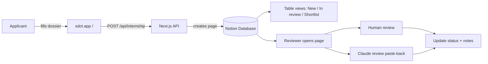

# SDOT Internship — Notion Intake & Review Setup

Complete setup for **Notion as the primary application inbox** with human review and Claude-assisted screening.

---

## Architecture



**Flow:** Form → API validates → Notion page created (status **New**) → Team reviews in Notion → Status updated → Email shortlisted candidates.

---

## Notion API conventions (SDOT uses these)

Per the [Notion API introduction](https://developers.notion.com/reference/intro):

| Convention | SDOT usage |
|------------|------------|
| Base URL | `https://api.notion.com/v1/...` |
| Auth | `Authorization: Bearer {NOTION_API_KEY}` |
| Version header | `Notion-Version: 2026-03-11` |
| Database ID | From URL — dashes optional (`3bce995156ee80de8352d92664663ce1`) |
| Create row | `POST /v1/pages` with `parent.data_source_id` + `properties` + `markdown` |
| List rows | `POST /v1/data_sources/{id}/query` with cursor pagination (Notion UI or API) |

**Valid bearer tokens** (pick one):

1. **Personal access token (PAT)** — `ntn_…` — easiest for setup ([tokens portal](https://www.notion.so/developers/tokens))
2. **Internal connection** — `secret_…` — team-owned bot ([connections](https://app.notion.com/developers/connections))
3. **OAuth public connection** — for multi-tenant apps (not needed for SDOT)

SDOT stores the token only in server env (`.env.local` / Vercel secrets), never in the browser.

---

## Phase 1 — Get a Personal Access Token (PAT)

Use Notion’s current auth flow ([API quickstart](https://developers.notion.com/guides/get-started/quick-start), [PAT guide](https://developers.notion.com/guides/get-started/personal-access-tokens)):

1. Open **[Personal access tokens](https://www.notion.so/developers/tokens)** in the Notion Developer portal
2. Select **New token**
3. Name: `SDOT Intake` · Capability: **Notion API** · Workspace: yours
4. Copy the token (`ntn_…`) → save as `NOTION_API_KEY`

> **PAT note:** PATs act as **you**. If you can open the internship database in Notion, the API can write to it — no **Connections → Add integration** step required.

Set locally:

```bash
# .env.local
NOTION_API_KEY=ntn_xxxxxxxx
NOTION_DATABASE_ID=3bc60e79f34b80a2b7a4e0242c46595e
```

Quick API smoke test ([Create a page](https://developers.notion.com/reference/post-page)):

```bash
curl -X POST https://api.notion.com/v1/pages \
  -H "Authorization: Bearer $NOTION_API_KEY" \
  -H "Notion-Version: 2026-03-11" \
  -H "Content-Type: application/json" \
  -d '{
    "parent": { "type": "data_source_id", "data_source_id": "YOUR_DATA_SOURCE_ID" },
    "properties": {
      "Name": { "title": [{ "text": { "content": "API test" } }] },
      "Review status": { "select": { "name": "New" } }
    },
    "markdown": "## Test\n\nConnection works."
  }'
```

| Error | Fix |
|-------|-----|
| `unauthorized` | Wrong or expired PAT |
| `object_not_found` | Wrong database ID or no access to that database |
| `validation_error` on property | Property name/type mismatch — see Phase 2 |

---

## Phase 1b — Alternative: Internal integration (team-owned bot)

For a **team-owned** automation (not tied to one person’s account), use an [internal connection](https://developers.notion.com/guides/get-started/internal-connections) at [my-integrations](https://www.notion.so/my-integrations) instead of a PAT. Then you **must** connect the database via **⋯ → Connections**.

Token format: `secret_…` instead of `ntn_…`

---

## Phase 2 — Create the database

In Notion, create a full-page database: **Internship Applications**

### Intake properties (filled automatically by the form)

| Property | Type | Notes |
|----------|------|-------|
| **Name** | Title | Candidate full name |
| Ref | Text | `SDOT-…` reference ID |
| Email | Text | |
| Phone | Text | |
| City | Text | Optional |
| Education | Text | |
| Portfolio | Text | URL |
| Interests | Text | Comma-separated chips |
| Why SDOT | Text | Short answer (also in page body) |
| Analysis | Text | ~100-word assessment (also in page body) |
| Tools | Text | Comma-separated |
| Hours/week | Text | |
| Start date | Text | ISO date |
| Video link | Text | Drive / YouTube / Loom URL |
| Video note | Text | Optional |
| Submitted | Text | ISO timestamp |

> Property names must match **exactly** (case-sensitive).

### Review properties (filled by your team)

| Property | Type | Options / notes |
|----------|------|-----------------|
| **Review status** | Select | `New` · `In review` · `Shortlisted` · `Rejected` · `Archived` |
| Reviewer | Person | Who owns the review |
| Score | Number | 1–10 optional rubric score |
| Claude summary | Text | Paste Claude output here |
| Review notes | Text | Internal team notes |
| Contacted | Checkbox | Email sent to candidate |

New applications are created with **Review status = New**.

### Page body (auto-generated)

Long responses are also written inside each page under headings:

- Why SDOT  
- Political assessment  
- Video note  
- Links (portfolio + video)

Open the **full page** for reading — use the **table view** for triage.

---

## Phase 3 — Grant access to the database

### If using a PAT (recommended for setup)
Ensure the token creator can open the database in Notion. No connection step needed.

Your database URL:
[Internship Applications](https://app.notion.com/p/3bc60e79f34b80a2b7a4e0242c46595e)

Database ID:
```
3bc60e79f34b80a2b7a4e0242c46595e
```

### If using an internal integration
1. Open the database → **⋯** → **Connections** → connect **SDOT Intake**

---

## Phase 4 — Connect the app

Copy `env.example` → `.env.local`:

```env
NOTION_API_KEY=ntn_xxxxxxxx
NOTION_DATABASE_ID=3bce995156ee80de8352d92664663ce1
```

Restart dev server: `npm run dev`

### Test

```bash
curl -X POST http://localhost:3000/api/internship \
  -H 'Content-Type: application/json' \
  -d '{
    "name":"Test Applicant",
    "email":"test@example.com",
    "phone":"9999999999",
    "city":"Hyderabad",
    "education":"Test University, BA, 2027",
    "portfolio":"",
    "interests":["Research","Writing"],
    "why":"Interested in independent political intelligence.",
    "analysis":"A recent state election showed shifting urban-rural patterns. The incumbent party retained seats but lost vote share in tier-2 cities, suggesting economic messaging mattered more than identity appeals in those districts.",
    "tools":["Canva"],
    "hoursPerWeek":"12",
    "startDate":"2026-09-01",
    "videoLink":"https://youtu.be/example",
    "videoNote":""
  }'
```

Check Notion — a new row with **Review status: New** should appear.

---

## Phase 5 — Create views (inbox workflow)

Create these **filtered views** on the database:

| View name | Filter | Sort | Purpose |
|-----------|--------|------|---------|
| **Inbox** | Review status is `New` | Submitted ↓ | Fresh applications |
| **In review** | Review status is `In review` | Submitted ↓ | Active queue |
| **Shortlisted** | Review status is `Shortlisted` | Score ↓ | Next round |
| **Rejected** | Review status is `Rejected` | Submitted ↓ | Archive |
| **All** | (none) | Submitted ↓ | Full history |

### Recommended table columns (Inbox view)

`Name` · `Ref` · `Submitted` · `Email` · `Interests` · `Hours/week` · `Start date` · `Review status` · `Score`

Hide long text columns (Analysis, Why SDOT) in table — open the page to read them.

---

## Phase 6 — Human review SOP

For each new application in **Inbox**:

1. Set **Review status** → `In review`
2. Assign **Reviewer**
3. Open the page → read **Why SDOT**, **Analysis**, watch **Video link**
4. Check portfolio if provided
5. Fill **Review notes** (internal)
6. Set **Score** (1–10) if using rubric
7. Move to **Shortlisted** or **Rejected**
8. For shortlisted: check **Contacted** after email sent

### Review rubric (suggested)

| Criterion | What to look for |
|-----------|------------------|
| Writing | Clear analysis, not generic |
| Curiosity | Specific political story, not buzzwords |
| Fit | Interest aligns with SDOT work |
| Commitment | Realistic hours + start date |
| Video | Articulate, prepared, on-brief |

---

## Phase 7 — Claude-assisted review

### Manual (works today)

1. Open application page in Notion
2. Copy: Name, Education, Interests, Why SDOT, Analysis, Video note
3. Paste into Claude with this prompt:

```
You are reviewing SDOT internship applications. SDOT is an independent
political intelligence platform. Evaluate this candidate for a writing/
research/design internship. Be concise and actionable.

Return:
- Score (1-10)
- Strengths (3 bullets)
- Gaps (2 bullets)
- Shortlist recommendation (Yes / Maybe / No)
- One follow-up question if shortlisted

Application:
[paste here]
```

4. Paste Claude output into **Claude summary**
5. Use output to inform **Review notes** and **Review status**

### Automated (future — not built yet)

Possible next step: API route or scheduled job that reads `Review status = New`, calls Claude API, writes **Claude summary**, sets status to `In review`. Ask to implement when volume justifies it.

---

## Phase 8 — Team & permissions

| Role | Notion access |
|------|----------------|
| Reviewers | Full access to database, can edit review fields |
| Read-only | Can view, cannot edit status |
| Integration | Insert only via API (no human login needed) |

Do **not** share `NOTION_API_KEY` — it lives only in server env (Vercel / hosting secrets).

---

## Phase 9 — Production deploy

On Vercel (or your host):

### Required environment variables

| Variable | Production value |
|----------|------------------|
| `NOTION_API_KEY` | Secret (`ntn_…` or internal connection token) |
| `NOTION_DATABASE_ID` | Your intake database ID |

Optional: `NOTION_DATA_SOURCE_ID` (auto-resolved from database)

### Deploy steps

1. Add env vars in Vercel → **Settings → Environment Variables** (Production scope)
2. Connect the database to your Notion integration (**⋯ → Connections → SDOT**)
3. Redeploy
4. Delete test rows in Notion (connection tests from setup)
5. Submit one real test application on the production URL
6. Confirm row in Notion with **Review status: New**

### Production safeguards (built in)

- Rate limiting: 5 submissions / hour / IP on `/api/internship`
- Honeypot field on the form (bot trap)
- Server-side validation (field limits, allowed interests/tools, min word count)
- Notion failure fails the request — no silent partial writes
- Generic error messages in production (no Notion API details leaked)
- Security headers (`X-Frame-Options`, `Referrer-Policy`, etc.)
- `/api/` disallowed in `robots.txt`

### Before going public

- [ ] Rotate Notion token if it was ever pasted in chat or committed
- [ ] Remove test submissions from Notion
- [ ] Verify form submit → Notion row on production URL
- [ ] Share review SOP with team (Phase 7)

---

## Troubleshooting

| Error | Fix |
|-------|-----|
| `Notion API error 401` | Wrong `NOTION_API_KEY` |
| `Notion API error 404` | Wrong `NOTION_DATABASE_ID` or DB not shared with integration |
| `property ... does not exist` | Property name mismatch — check spelling & capitalisation |
| `Review status` validation error | Add Select property with option `New` exactly |
| Form says "not connected" | No destination configured — set Notion env vars |
| Duplicate submissions | Normal — dedupe manually by email in Notion |

---

## Checklist

- [ ] Integration created (`SDOT Intake`)
- [ ] Database created with all intake + review properties
- [ ] Select options for Review status include `New`
- [ ] Database connected to integration
- [ ] Production env vars set on host (`NOTION_API_KEY`, `NOTION_DATABASE_ID`)
- [ ] Test submissions deleted from Notion
- [ ] Production smoke test passed
- [ ] Inbox / Shortlisted views created
- [ ] Review SOP shared with team
- [ ] Claude prompt saved for reviewers
